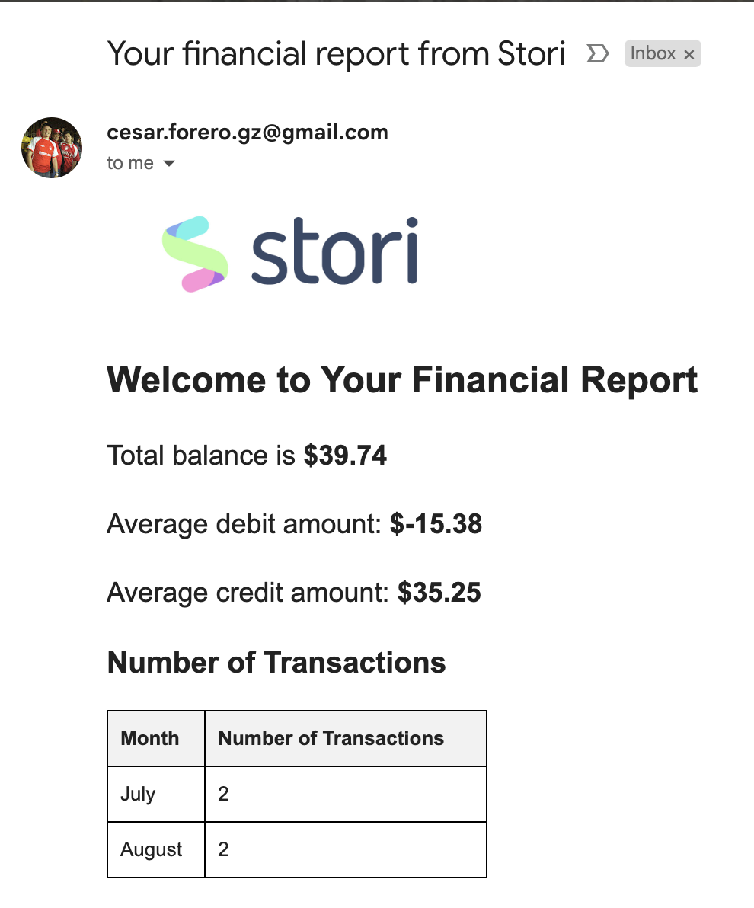
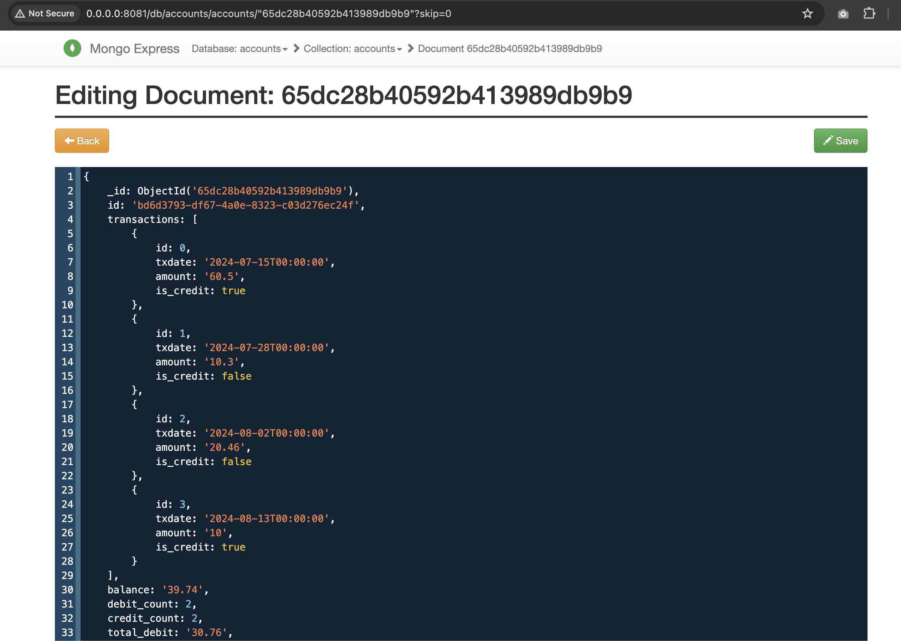

# Balance reporter

**Author: CesarF**

Application to process transactions data (including debit and credit transactions) that belongs to a account.

## Project structure
```
/
│
├── app # application code
│
├── config # initial configurations for some images
|
├── data # folder that will be mounted in the local execution. Contains the csv file.
│
├── images # assets
|
├── infra # TBI
|
├── docker-compose.yml # local deployment
|
└── README.md # you are here
```

## Local implementation

The local implementation allows to run the application locally using technologies in containers. Instead using cloud provider services, it uses mongodb and fastapi.

### Implementation details

- database: mongodb
- runtime: fastapi, uvicorn
- email: smpt implementation
- file: load file from volume

Check the docker compose file for more details

### How to run

Firstly, create a file named `local.env` in the root of this repository and include the next environment variables:

```
# local.env
EMAIL_SENDER=<email>
EMAIL_SENDER_PWD=<email password>
EMAIL_RECIPIENT=<email>
SMTP_SERVER=<smtp host>
SMTP_PORT=<smtp port>
```

Execute:

```bash
# create the image for local execution
make build

# execute docker compose
make run

# open another terminal (it is not using detach mode) and execute

curl -XPOST "http://localhost:9000/execute" -d '{}'
```

If everything worked as expected, you should see a response like this:

```
{'result':{'Message sent to <recipient email>':true}}
```

The recipient should have received an email like this one:



Also, you can see the information stored in the database entering the url `http://0.0.0.0:8081` in your browser; username `admin` password `pass`. Navigate to `accounts` database and select the record:



### How to test

Just execute

```bash
make test
```
