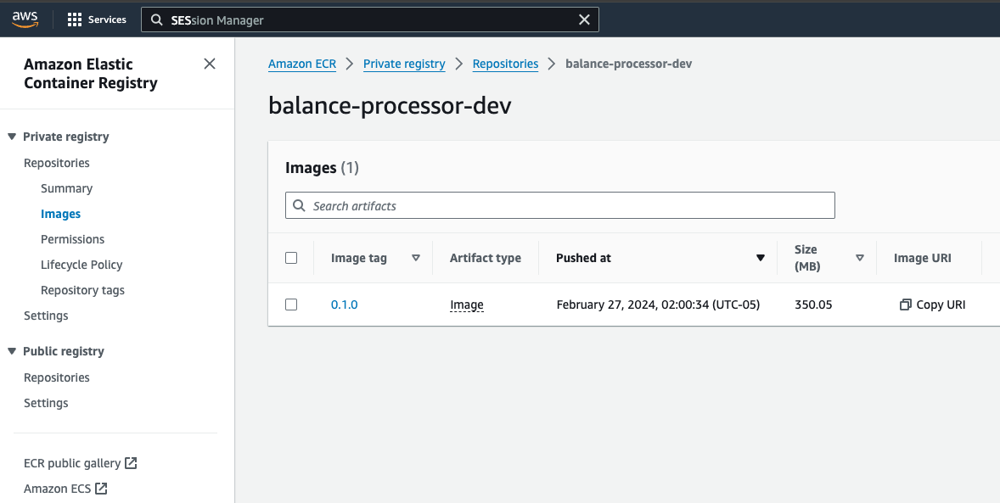

# Balance reporter

**Author: CesarF**

Application to process transactions data (including debit and credit transactions) that belongs to a account.

## Project structure
```
/
│
├── app # application code
│
├── config # initial configurations for some images
|
├── data # folder that will be mounted in the local execution. Contains the csv file.
│
├── images # assets
|
├── infra # TBI
|
├── docker-compose.yml # local deployment
|
└── README.md # you are here
```

## Local implementation

The local implementation allows to run the application locally using technologies in containers. Instead using cloud provider services, it uses mongodb and fastapi.

### Implementation details

- database: mongodb
- runtime: fastapi, uvicorn
- email: smpt implementation
- file: load file from volume

Check the docker compose file for more details

### How to run

Install Docker in your environment if they are not already installed. Then, create a file named `local.env` in the root of this repository and include the next environment variables:

```
# local.env
EMAIL_SENDER=<email>
EMAIL_SENDER_PWD=<email password>
EMAIL_RECIPIENT=<email>
SMTP_SERVER=<smtp host>
SMTP_PORT=<smtp port>
```

Execute:

```bash
# create the image for local execution
make build

# execute docker compose
make run

# open another terminal (it is not using detach mode) and execute

curl -XPOST "http://localhost:9000/execute" -d '{}'
```

If everything worked as expected, you should see a response like this:

```json
{"result":{"Message sent to <recipient email>":true}}
```

The recipient should have received an email like this one:


Also, you can see the information stored in the database entering the url `http://0.0.0.0:8081` in your browser; username `admin` password `pass`. Navigate to `accounts` database and select the record:


Update the data in `./data/txns.csv` and execute again the curl command.

### How to test

Just execute

```bash
make test
```

## AWS Implementation

The AWS implementation allows to run the application on a cloud provider using AWS services.

### Implementation details

- database: dynamodb
- runtime: Lambda function
- email: SES
- file: S3 Bucket

### How to deploy

To deploy this in your own AWS account follow the next steps.

First, verify these tools are installed in your environment:

- Terraform
- AWS CLI
- Docker

Configure your AWS account user. Use `aws configure` to set an access key and a secret key from your account. Note: your user requires enough permissions to manage s3, Dynamo, SES, Lambda, API Gateway and IAM.

> Take into account all the components will be deployed in us-east-1 region.

After finishing the configuration, create the registry for the lambda function container image.

```bash
STACK=registry make tf-init

STACK=registry make tf-plan

STACK=registry make tf-deploy
```

Next, upload the image using the next commands:

```bash
# create the image for aws execution
make build STAGE=aws

# login with ECR repository
make login ACCOUNT=<your account id>

# upload your image
make push ACCOUNT=<your account id>
```

Access to ECR and verify the image was uploaded



To create the application infrastructure you need to create a file named `aws.env` in the root path and add the next content:

```
# aws.env
email_sender="<email>"
email_recipient="<email>"
```

Then execute the next commands:

```bash
STACK=app make tf-init

STACK=app EXTRA_VARS=-var-file=${PWD}/aws.env make tf-plan

STACK=app make tf-deploy
```

If everything worked as expected, you should see this output in your terminal:

```bash
...
Apply complete! Resources: x added, x changed, 0 destroyed.

Outputs:

apigateway_url = "https://<api id>.execute-api.us-east-1.amazonaws.com/v1"
bucket_name = "balance-processor-dev--<random-value>"
```

Access to SES and verify the email sender (the same you configured in `aws.env` file).


Copy the bucket name and execute the next command. After finishing the csv file will be uploaded to the s3 bucket:

```bash
make upload BUCKET=<bucket-name>
```

Verify the file was uploaded as expected


And finally, test the application. Copy the api gateway path from the terraform output and execute:

```bash
curl -XPOST "<api gateway url>" -d '{}'
```

If everything worked as expected, you should see a response like this:

```json
{"result":{"Message sent to <recipient email>":true}}
```

The recipient should have received an email like this one:


If you access to Dynamo DB you will see the data is stored in the balance-processor table:


### How to destroy

After finishing your tests, it is time to destroy all the resources to avoid unnecessary costs in your account. Execute the next commands to destroy your infrastructure:

```bash
# delete app resources
STACK=app EXTRA_VARS=-var-file=${PWD}/aws.env make tf-destroy

# delete ecr repository
STACK=registry make tf-destroy
```
